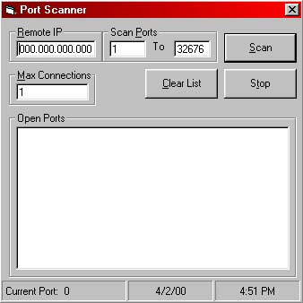



## A Fully Documented Winsock Port Scanner

### Description

An example of how to use winsock to make multiple connections to a remote host and scan for open ports. A must see app for people who want to learn more about winsock!
 
### More Info
 
Need to have a small understanding of how the MS Winsock control works.

             |
---                |---
**Submitted On**   |2000-04-02 16:39:10
**By**             |[Scott Pierce](https://github.com/Planet-Source-Code/PSCIndex/blob/master/ByAuthor/scott-pierce.md)
**Level**          |Intermediate
**User Rating**    |4.8 (86 globes from 18 users)
**Compatibility**  |VB 5\.0, VB 6\.0
**Category**       |[Internet/ HTML](https://github.com/Planet-Source-Code/PSCIndex/blob/master/ByCategory/internet-html__1-34.md)
**World**          |[Visual Basic](https://github.com/Planet-Source-Code/PSCIndex/blob/master/ByWorld/visual-basic.md)
**Archive File**   |[CODE\_UPLOAD4480422000\.zip](https://github.com/Planet-Source-Code/scott-pierce-a-fully-documented-winsock-port-scanner__1-6956/archive/master.zip)

